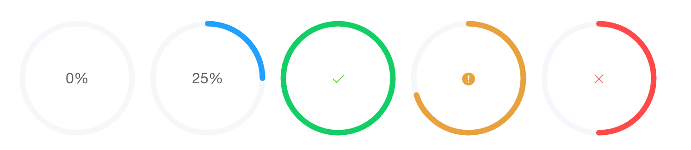
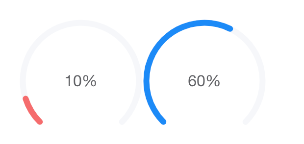

 # Тестовое задание

## Задача 1

Реализовать на Vue 3 (composition api) без использования сторонних библиотек компонент кругового прогресс бара. В реализации использовать SVG, не canvas. Реализация и через svg и через canvas будет плюсом, но обязательная программа - SVG.

Прогрессбар имеет 4 состояния - in progress, success, warning, error.
При изменении значения прогресс бара анимация увеличения должна быть плавной. Изменения статуса так же должно быть плавным.
По мере увеличения значения прогресс бара цвет заполненного сектора окружности меняется от красного к зеленому.
Компонент должен быть полноценным, готовым к использованию в проекте. Подготовить страницу с демонстрацией возможностей компонента.

Так же должна быть возможность изменить тип прогресс бара на dashboard, в таком случае он должен изменить форму на следующую:

